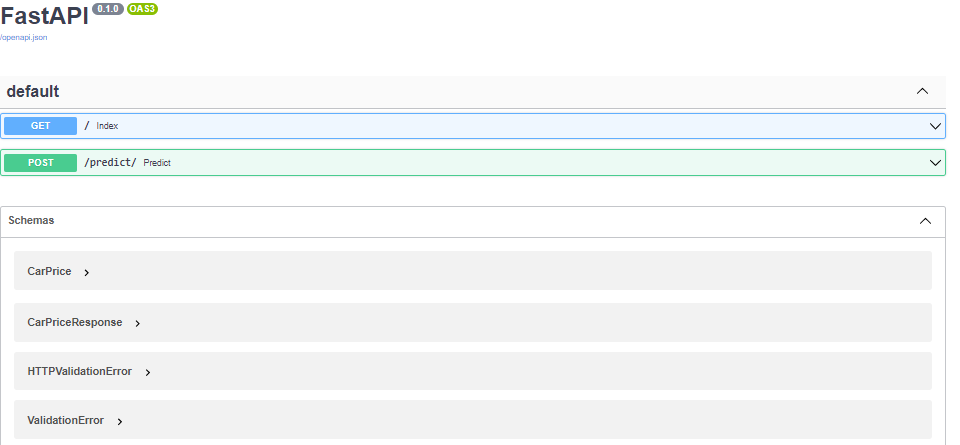
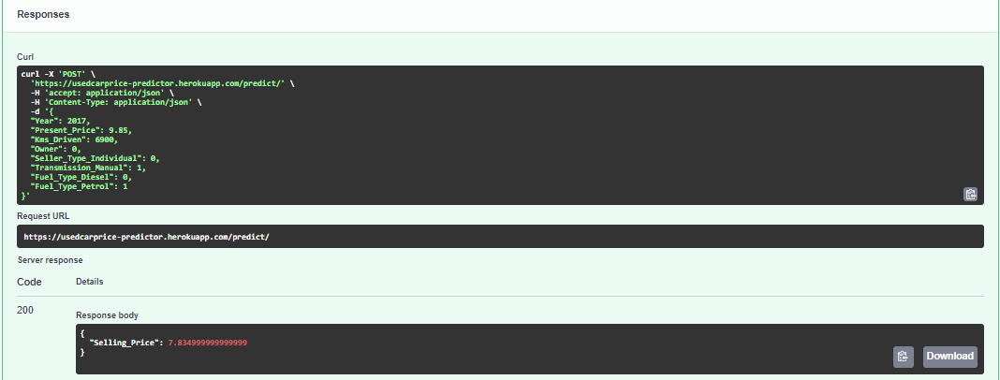

# UsedCarPrice-Predictor


This is a Supervised Machine Learning based model. Algorithms used in this model are:
* Linear Regression
* SVR
* KNN 
* Decision Tree
* Random Forest for Regression
* GridSearch CV on Random Forest

 Here, Selling Price of a used car is predicted on the basis of given features like Year, Present Price, Kms Driven, Transmission mode, Seller Type, Fuel Type and owner.
 
 The R2 score and RMSE value from different models are found to be:
```
The R2 Score,Bias & RMSE value for  Linear Regression is 0.6576364489340596 , 9.0 & 3.05629557865939 respectively.
The R2 Score,Bias & RMSE value for  SVR is -0.06230577764424439 , 29.0 & 5.383644370018745 respectively.
The R2 Score,Bias & RMSE value for  KNN is 0.002453284381575438 , 27.0 & 5.216968488886138 respectively.
The R2 Score,Bias & RMSE value for  Decision Tree Regressor is 0.7438270965512692 , 7.0 & 2.643736623291612 respectively.
The R2 Score,Bias & RMSE value for  Random Forest is 0.8733907611265234 , 3.0 & 1.8585929737237548 respectively.
The R2 Score,Bias & RMSE value for  GridSearch CV on Random Forest is 0.9033470958982315 , 3.0 & 1.6238991176931048 respectively.
```
<br>


### Dataset 
Load the file car.csv from the model folder.


### Requirements

1. Python <br>
2. FastAPI<br>
3. Sklearn<br>
4. Uvicorn<br>
5. Pandas<br>
6. Heroku Cli

### Structure

```sh
├── model/CarPricePrediction        # machine learning model is here
├── model/model.pkl     # pickle file for GridSearch Cv on Random Forest Regressor
├── main.py            # API is here for ML Model
├── schemas.py       # schema of model
├── requirements.txt  # packages needed to install
```

### FastAPI
<p align="center">
  <a href="https://fastapi.tiangolo.com"></a>
</p>
---

**Documentation**: <a href="https://fastapi.tiangolo.com" target="_blank">https://fastapi.tiangolo.com</a>

**Source Code**: <a href="https://github.com/tiangolo/fastapi" target="_blank">https://github.com/tiangolo/fastapi</a>

---

FastAPI is a modern, fast (high-performance), web framework for building APIs with Python 3.6+ based on standard Python type hints.


#### Interactive API docs

Now go to <a href="http://127.0.0.1:8000/docs" class="external-link" target="_blank">http://127.0.0.1:8000/docs</a>.

You will see the automatic interactive API documentation (provided by <a href="https://github.com/swagger-api/swagger-ui" class="external-link" target="_blank">Swagger UI</a>):




Heroku CLI
==========


The Heroku CLI is used to manage Heroku apps from the command line. It is built using [oclif](https://oclif.io).

For more about Heroku see <https://www.heroku.com/home>

To get started see <https://devcenter.heroku.com/start>
[](https://heroku.com/deploy)

# To see the deployed API go to 
```https://usedcarprice-predictor.herokuapp.com/docs```

### Local Development / Testing /Contribution

1. Clone this repo.
2. `create virtualenv (your environment name)`
3. `pip install -r requirements.txt`
4. Make Changes
5. Create the Pull request
6. Wait for a day to get your changes merged if useful.
